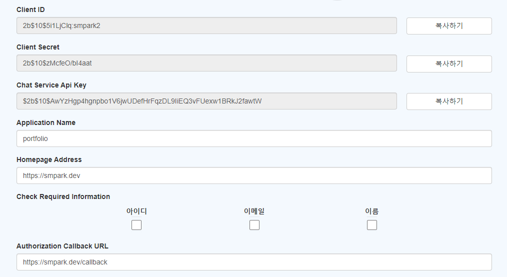
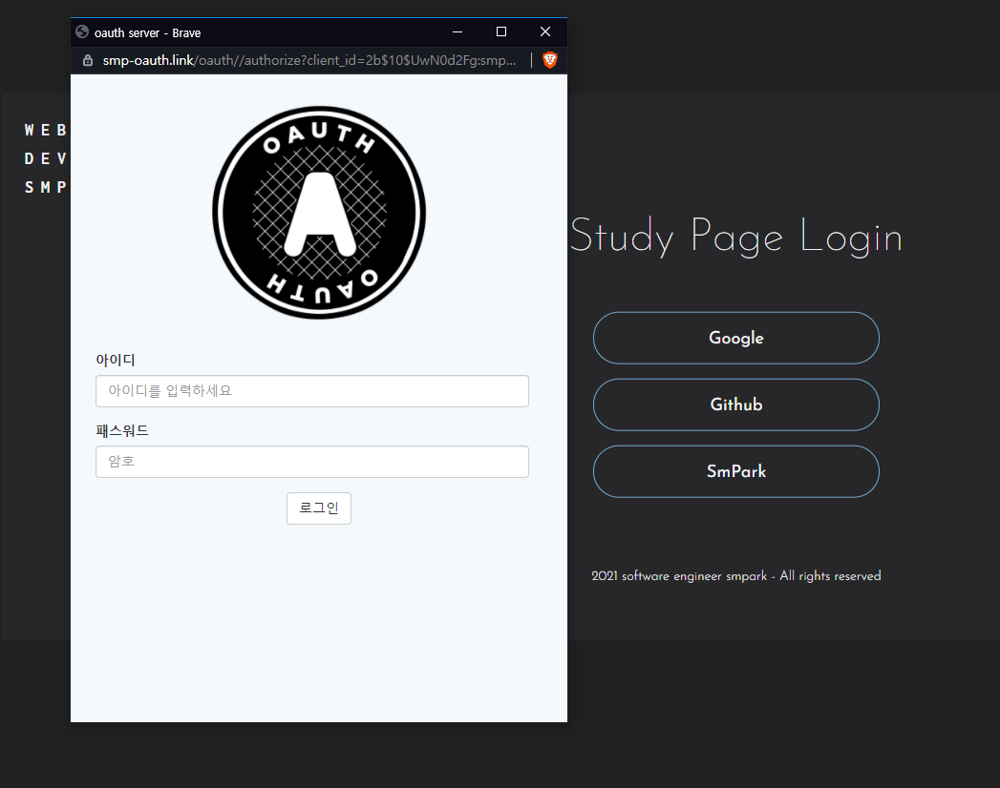

# SMP Oauth Server

`SMP Oauth Server`는 직접 만든 Oauth 2.0 서버입니다.  
JWT 로그인 기능을 제작하면서 평소에도 사용하는 Oauth 2.0에 대해서 깊게 공부해 보고 싶었습니다.  
항상 반복하는 CRUD가 아닌 색다른 BE 개발을 해보고 싶었고 스스로 흥미로운 주제였기에 직접 제작해보았습니다.

[📑[rfc6749]](https://datatracker.ietf.org/doc/html/rfc6749)의 구조와 권고를 베이스로 제작하였습니다.

<br>

## Version

`SMP Oauth Server`_(v1.0.0)_

<br>

## IDE

       

- **Tool** - `VSCode`_(v1.57)_
- **Back End** - `NodeJS(Express)`_(v12.16.4)_
- **Front End** - `ES5(jQuery, CommonJS)`
- **Data Base** - `MongoDB(Mongoose)`_(v4.4.6)_
- **Web Server** - `Ubuntu`_(v18.04.5 LTS)_, `Nginx`_(v1.14.0)_
- **Cloud Computing** - `AWS EC2 Prettier`

<br>

## Flow (Oauth 2.0)


<br>

## Secure

`SMP Oauth Server`를 제작하면서 가장 중점을 두었던 부분은 보안입니다.
아래와 같은 보안 검증을 구현하였습니다.

<br>

- `state` : CSRF 공격에 대비하여 공격자가 예상할 수 없는 state 데이터를 생성하여 URI에 담고 code와 함께 callback 된 state를 검증합니다.

  ```javascript
  // 1번 Flow, 코드생성
  const randomStarg = Math.random().toString();
  const state = await bcrypt.hash(randomStarg, 10);
  const uri = `${oauthURL}/authorize?client_id=${client_id}&redirect_uri=${redirect_uri}&state=${state}`;

  // 2 -> 3번 Flow, 코드검증
  const valid = await bcrypt.compare(prevState, state);
  if (!valid) throw new Error(`인증과정 중 외부 간섭의 위험이 있습니다.`);
  ```

<br>

- `redirect_uri` : redirect_uri 변조를 통한 code 탈취를 막기 위해 `SMP Oauth Server`에 등록된 redirect_uri와 실제로 요청된 redirect_uri의 동일성 검증합니다.
  [[📑[rfc6819]](https://datatracker.ietf.org/doc/html/rfc6819#section-5.2.3.5)] 권고

  ```javascript
  const redirectCheck = (redirectUri, redirect_uri) => {
    if (redirectUri !== redirect_uri) {
      return false;
    }
    return true;
  };
  ```

<br>

- `xss` : Helmet의 xssFilter와 xss 패키지를 사용하여 스크립트 삽입 공격에 대비합니다.

  ```javascript
  const helmet = require('helmet');
  app.use(helmet.xssFilter());

  const xss = require('xss');
  const refererCheck = xss(referer); // script uri escape

  // xss 검사
  return referer !== refererCheck ? false : true;
  ```

<br>

- `dos` : Express-rate-limit module의 사용으로 반복된 요청을 통한 `SMP Oauth Server`의 마비를 방지합니다.

  ```javascript
  const rateLimit = require('express-rate-limit');

  const limiter = rateLimit({
    windowMs: time,
    max: maxConnect,
    headers: true,
    message: '해당 IP의 요청이 너무 많습니다. 잠시 후에 다시 시도하십시오',
  });
  ```

<br>

- `Refresh Token` : 통신 중 `Access Token`을 탈취당할 위험을 최소화하기 위해 유효시간을 10분 이하로 설정하고 `Refresh Token`을 통해 재발급하도록 구현하였습니다. 유효시간이 만료되면 자동으로 로그아웃됩니다.

  ```javascript
  const refTknTime = 5;
  const refTknExpiresAt = await createExpiresAt('hour', refTknTime);

  const refresh_token = createRefreshToken({
    id: client_id,
    secret: clientSecret,
    user: username,
    expiresIn: refTknExpiresAt,
  });
  ```

<br>

- `etc` : SSL 적용, HTTP Only Cookies 적용, Code & Token 만료 시간 준수, Query parameter 방식이 아닌 Bearer Authentication 방식 사용 [[📑[rfc6750]](https://datatracker.ietf.org/doc/html/rfc6750)] 권고

  ```javascript
  this.smp_resource.defaults.headers.common = {
    Authorization: `bearer ${token.accessToken}`,
  };
  ```

<br>

## Usage

#### Word

- `Client ID(client_id)` - 유저식별 ID
- `Client Secret(secret_key)` - access_token 발급 전 최종적인 유저 확인용 비밀키
- `Check Required Information (scope)` - `Resource Server`가 Client Site에 전달할 유저 정보 범위
- `Authorization Callback URL (redirect_uri)` - callback redirect 할 URL -> 해당 URL로만 데이터 전송
- `Homepage Address` - referer 도메인 검사를 위한 Address
- `Access Token` - `Resource Server`로 데이터를 요구하기 위한 Token -> 유효시간 10분
- `Refresh Token` - `Access Token`을 갱신하기 위한 Token -> 유효시간 5시간
- `State` - 통신 데이터의 무결성을 확인하기 위한 고유 문자열
- `Code` - User Resource Owner의 Client Site 로그인 성공 시 발급하는 코드

<br>

#### Register

1. [📝[smp-oauth.link]](https://smp-oauth.link)에서 회원가입 후 로그인
2. Homepage Address, Authorization Callback URL, Check Required Information 항목 기재 후 등록 

<br>

#### Code (Example FE JavaScript Code)

1. Client 코드 작성 (1.Flow)

```javascript
constructor() {
    this.smp_oauth = axios.create({
      baseURL: 'https://smp-oauth.link/oauth',
    });
    this.smp_resource = axios.create({
      baseURL: 'https://smp-resource.link/auth',
    });
  }
```

```javascript
const client_id = process.env.CLIENT_ID; // smp-oauth.link -> Client_id
const redirect_uri = process.env.REDIRECT_URI; // smp-oauth.link -> Authorization Callback URL
const state = await bcrypt.hash(Math.random().toString(), 10); // generate by client & Encryption is recommended

// uri redirect -> method GET
const uri = `${this.smp_oauth}/authorize?client_id=${client_id}&redirect_uri=${redirect_uri}&state=${state}`;

window.open(uri, 'oauthServer', 'width=520,height=680');
```

<br>

2. Redirect_uri에 로그인 페이지 Load 후 로그인 진행 (2.Flow )
   
   <br>

3. `SMP Oauth Server`에서 callback으로 전달받은 code, state parsing 후 redirect token (3.Flow -> 4.Flow)

```javascript
// example const code = params.get('code');
// example const state = params.get('state');

const valid = await bcrypt.compare(prevState, state); // state verification
if (!valid) throw new Error(`인증과정 중 외부 간섭의 위험이 있습니다.`);

const data = {
  code,
  client_id: process.env.CLIENT_ID,
  clientSecret: process.env.SECRET_KEY, //  smp-oauth.link -> Client_secret
  redirect_uri: process.env.REDIRECT_URI,
  grant_type: 'code',
};

// uri redirect -> method POST
const response = await this.smp_oauth.post('token', data);
```

<br>

4. `SMP Oauth Server`에서 전달받은 access_token을 `SMP Resource Server`로 bearer 전달 (5.Flow -> 6.Flow)

```javascript
const token = oauthRes.data.access_token;
this.smp_resource.defaults.headers.common = {
  Authorization: `bearer ${token.accessToken}`,
};

const response = await this.smp_resource.get('scope');
// finish
const userData = resourceRes.data.userData;
```

<br>

## ETC

#### Structure

처음 해당 프로젝트를 설계할 때 고민했던 프로젝트 구조입니다.  
모든 로직을 하나의 폴더 혹은 파일에 구현하여 발생하는 스파게티 코드가 아닌 효율적으로 코드 구조를 나누고 싶었습니다.  
유지보수를 위해서 각각 폴더와 파일에 역할을 부여하고 파일의 로직을 함수로 명명함으로써 함수형 프로그래밍 구조를 구현해보고 싶었습니다.

- **Middleware** : API 통신을 하기 전 실행할 로직을 수행하는 곳입니다. JWT를 통한 인가, 웹 통신의 제한, 검증, 로깅 등을 실행합니다.
- **API** : 브라우저와 웹 통신에 대한 것만을 처리하는 공간입니다.
- **Ctrl** : API 통신을 통해 들어오는 데이터를 혹은 로직을 처리하는 공간입니다. `Ctrl`에서 `Functions`를 통해 로직을 수행하고 `Models`를 통해 DB와 통신합니다.
- **Functions** : 오직 데이터를 가공하는 공간입니다.
- **Models** : 가공된 데이터를 `Ctrl`을 통해 받아, DB 통신을 통해 CRUD를 수행합니다.

Project structure


위와 같은 `Structure`를 구현하여 이용해본 결과, 폴더와 파일 각각의 위치와 역할이 정해져 있고 그 안에서 로직을 함수로 명명함으로써 시간이 지나도 헷갈리지 않고 유지보수 시 필요한 요소를 빠르게 찾을 수 있으며, 문제 발생 시 문제의 원인을 빠르게 구분할 수 있었습니다.

<br>

#### Log

`SMP Oauth Login` 유저의 접속 기록과 에러 상황을 Log를 통해 각각 기록합니다. 특히 Error의 경우 어느 곳, 어떤 함수에서 에러가 발생했는지 기록하고 있습니다.

```javascript
const winston = require('winston');
const infoTransport = new winston.transports.File({
  filename: 'info.log',
  dirname: logDir,
  level: 'info',
});

const errorTransport = new winston.transports.File({
  filename: 'error.log',
  dirname: logDir,
  level: 'error',
});
```

info.log


<br>

#### End Comment

`smpark` - 해당 프로젝트는 그동안 사용해온 es5와 commonJS를 제 안에서 갈무리한다는 생각으로 만들어본 마지막 es5 프로젝트 입니다.  
번아웃으로 개발에 흥미를 잃었던 저에게 최소한의 단서로 Flow를 따라가며 '아마 이렇게 구현하면 되지 않을까?' 상상하는 재미를, 그리고 그것을 내 뜻대로 구현하는 개발의 즐거움을 다시 일깨워준 프로젝트입니다.
Readme는 여기까지입니다.  
읽어주셔서 감사합니다.
