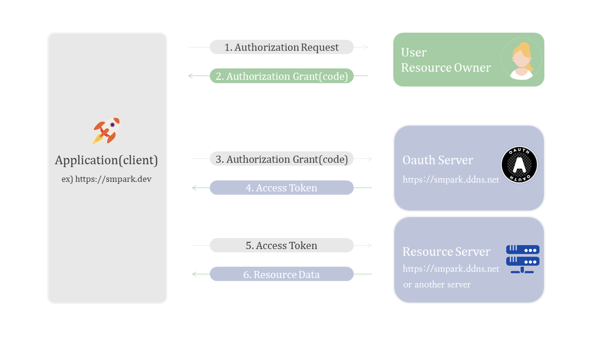
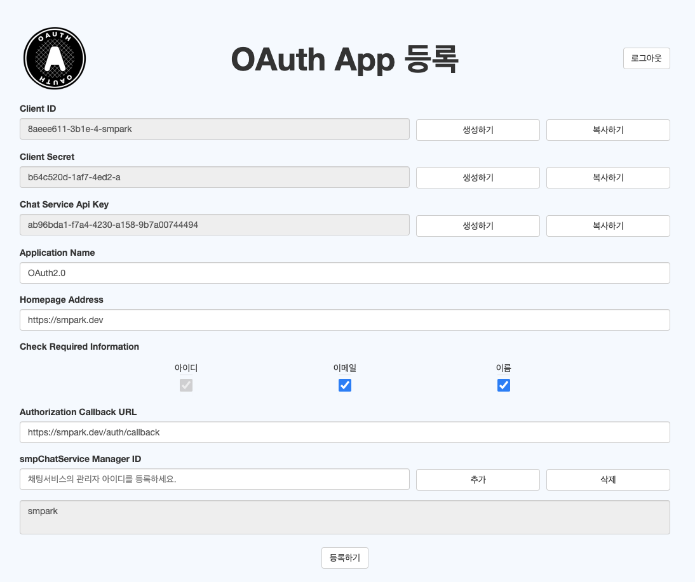
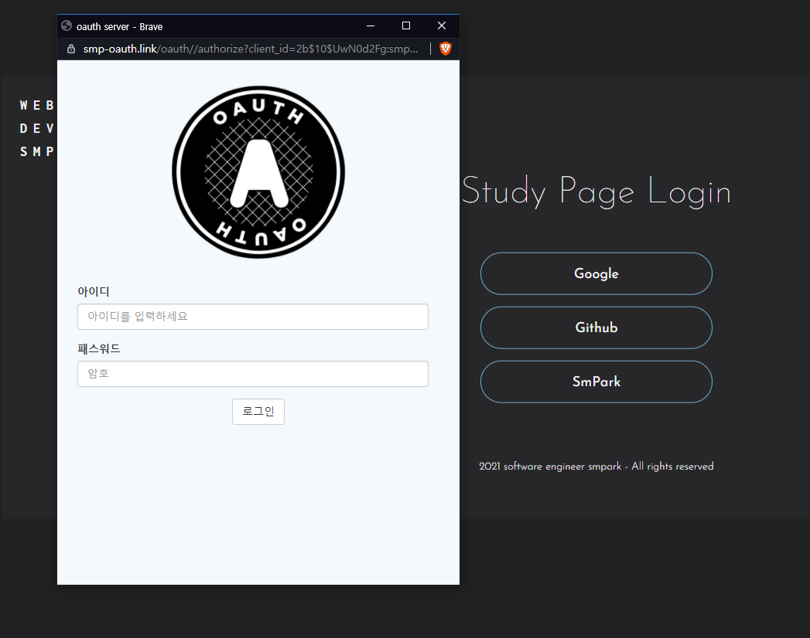
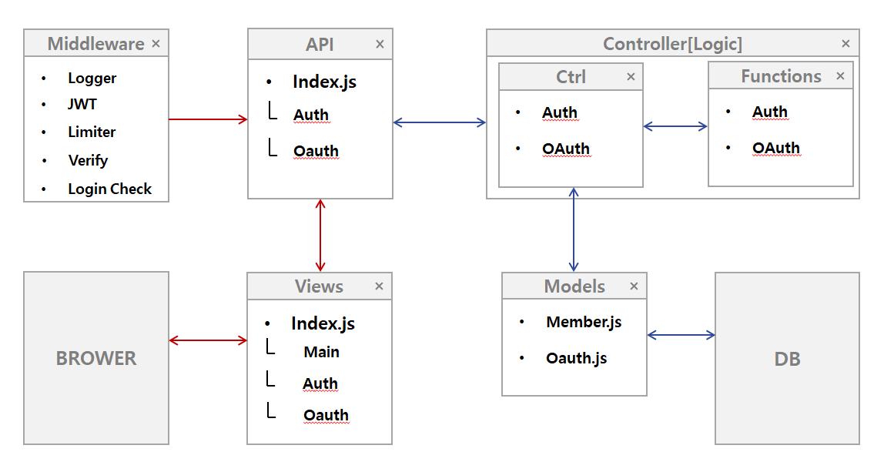
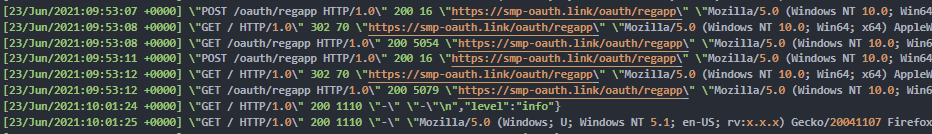

# smPark OAuth2.0 Server

`smPark OAuth2.0 Server`는 3년 전 보안 공부를 위해 만들었던 OAuth 2.0 서버를 클린 아키텍처와 최신 기술을 적용하여 리마스터한 프로젝트입니다.
README.md는 OAuth2.0에 대한 간단한 소개 및 사용방법, 폴더 구조 및 아키텍처, 기타 설정 등에 대한 소개입니다.

## 주요 특징

- **클린 아키텍처**:
  유지보수성과 확장성을 고려한 구조로 설계되었습니다.

- **Yarn PnP (Zero Install)**:
  PnP 기능을 체험하고 Zero Install의 속도를 확인하기 위해 적용해보았습니다.

- **TypeScript**:
  정적 타입 체크(Strict)를 통해 코드의 안정성과 가독성을 향상시켰습니다.

- **ESLint**:
  코드 품질과 일관성을 유지하기 위해 엄격한 린팅 규칙을 적용하였습니다.

- **Docker**:
  컨테이너화를 통해 개발 환경과 배포 환경의 일관성을 보장하였습니다.

- **JEST/Cypress**:

  - 서비스 로직을 유닛 테스트 하였습니다.
  - OAuth 인증의 성공 사례를 E2E 테스트 하였습니다.

- **CI/CD**:
  GitHub Actions를 통해 지속적인 통합 및 배포 파이프라인을 구축하였습니다.

## Version

`smPark OAuth2.0 Server`_(v1.0.0)_

## IDE


- **Tool** - `VSCode` _(v1.91.1)_
- **Back End** - `Node.js` _(v20.14.0)_, `Express` _(v4.19.2)_
- **Front End** - `JavaScript Module` _(ES6+)_, `TypeScript` _(v5.5.2)_
- **Database** - `MongoDB (Atlas)` _(v6.7.0)_
- **Web Server** - `Nginx` _(v1.27.0)_
- **Linting** - `ESLint` _(v9.5.0)_
- **Formatting** - `Prettier` _(v3.3.2)_
- **Containerization** - `Docker` _(v24.0.2)_
- **Package Management** - `Yarn` _(v4.3.1)_
- **Version Control** - `Git` _(v2.40.1)_
- **Testing** - `Jest` _(v29.7.0)_, `Cypress` _(v13.13.0)_
- **Deployment Environment** - `macOS` _(v14.5 Sonoma on MacBook)_

<br>
[📑[rfc6749]](https://datatracker.ietf.org/doc/html/rfc6749)의 구조와 권고를 베이스로 제작하였습니다.

[🚀[smpark.ddns.net]](https://smpark.ddns.net) 사이트 이동
<br>

## Flow (OAuth 2.0)



<br>

#### Word

OAuth2.0에서 쓰이는 용어 설명입니다.

- `Client ID (client_id)` - 클라이언트 애플리케이션을 식별하기 위한 공개된 식별자.
- `Client Secret (client_secret)` - 클라이언트 애플리케이션을 인증하기 위한 비밀 키로, 서버 간 통신에서만 사용됨.
- `Scope` - 클라이언트가 접근하려는 리소스 서버의 자원 범위.
- `Authorization Callback URL (redirect_uri)` - 권한 부여 코드 또는 액세스 토큰을 전달받을 클라이언트의 URL.
- `Homepage Address` - 클라이언트의 홈페이지 URL로, 일반적으로 referer 도메인 검사를 위해 사용됨.
- `Access Token` - 리소스 서버에서 보호된 자원에 접근하기 위한 토큰. 유효 시간은 일반적으로 10분.
- `Refresh Token` - 새로운 액세스 토큰을 발급받기 위한 토큰. 유효 시간은 일반적으로 5시간.
- `State` - 요청의 무결성을 검증하기 위한 고유한 문자열.
- `Authorization Code` - 사용자가 클라이언트에 로그인하여 권한을 부여한 후 발급되는 코드. 클라이언트는 이 코드를 사용하여 액세스 토큰을 요청함.

<br>

## Secure

`smPark OAuth2.0 Server`를 제작하면서 가장 중점을 두었던 부분은 보안입니다.
아래와 같은 보안 검증을 구현하였습니다.

<br>

- `state` : CSRF 공격에 대비하여 공격자가 예상할 수 없는 state 데이터를 받아 클라이언트 어플리케이션의 redirect_uri에 담아 되돌려줍니다.
- ```javascript
  try {
    const { redirect_uri, state } = req.session;
    const code = await this.codeGenerationUseCase.execute(id);

    return res.redirect(`${redirect_uri}?code=${code}&state=${state}`);
  } catch (error) {
    next(error);
  }
  ```

<br>

- `redirect_uri` : redirect_uri 변조를 통한 code 탈취를 막기 위해 `smPark OAuth2.0 Server`에 등록된 redirect_uri와 실제로 요청된 redirect_uri의 동일성 검증합니다.
  [[📑[rfc6819]](https://datatracker.ietf.org/doc/html/rfc6819#section-5.2.3.5)] 권고

  ```javascript
  const redirect_uri = this.validateField(
    ERROR_MESSAGES.VALIDATION.MISSING.REDIRECT_URI,
    ERROR_MESSAGES.VALIDATION.MISMATCH.REDIRECT_URI,
    request.redirect_uri,
    oauth?.redirect_uri,
  );
  ```

<br>

- `xss` & `referer` xss 패키지를 이용하여 refererUri에서 스크립트를 제거한 후, 기존에 등록된 addressUri와 비교하여 레퍼러를 검사합니다.

  ```javascript
  private validateReferer(refererUri?: string, addressUri?: string): string {
      if (!refererUri) {
        throw createError(400, ERROR_MESSAGES.VALIDATION.MISSING.REFERER_URI);
      }

      if (
        addressUri &&
        this.normalizeUri(refererUri) !== this.normalizeUri(addressUri)
      ) {
        throw createError(401, ERROR_MESSAGES.VALIDATION.MISMATCH.ADDRESS_URI);
      }

      return refererUri;
    }

  private normalizeUri(uri: string): string {
    const validUri = xss(uri);
    return validUri.endsWith('/') ? validUri.slice(0, -1) : validUri;
  }
  ```

<br>

- `DoS(Denial of Service)` : Express-rate-limit 사용으로 반복된 요청을 통한 Server의 마비를 방지합니다. `DoS` 공격엔 어느정도 효과가 있지만 `DDoS(Distributed Denial of Service)`는 더 고도의 방어 방법 필요합니다. CDN을 통한 트래픽 분산, 방화벽 사용, DDoS 방어 전용 클라우드 서비스 등등이 있습니다.

  ```javascript
  const rateLimit = require('express-rate-limit');

  const rateLimiterMiddleware = rateLimit({
    windowMs: rateLimitWindowMs, // 1분
    max: maxRequestsPerWindow, // 1분 동안 최대 50번의 요청
    headers: true,
    message: ERROR_MESSAGES.RATE_LIMIT.EXCEEDED,
  });
  ```

<br>

- `Refresh Token` : 통신 중 `Access Token`을 탈취당할 위험을 최소화하기 위해 유효시간을 10분 이하로 설정하고 `Refresh Token`을 통해 재발급하도록 구현하였습니다. 유효시간이 만료되면 자동으로 로그아웃됩니다.

  ```javascript
  generateToken(
    payload: object,
    jwtSecretKey: string,
    expiresIn: number,
  ): string {
    const jwtToken = jwt.sign(payload, jwtSecretKey, {
      expiresIn,
    });

    return jwtToken;
  }
  ```

<br>

## Usage
간단한 이용 방법입니다.


#### Register


1. [📝[smpark.ddns.net]](https://smpark.ddns.net)에서 회원가입 후 로그인
2. Client ID, Client Secret 생성
3. Homepage Address, Authorization Callback URL, Check Required Information 항목 기재 후 등록


<br>

#### Client 토큰 요청 (Example FE JavaScript Code)

1. Client 코드 작성 (1.Flow)

- `smPark OAuth2.0 Server`의 정보를 원하는 클라이언트 웹페이지에서 아래와 같은 방식으로 URI를 보냅니다.
  혹은 Next Auth 패키지의 도움을 받아 전달하여도 가능합니다.

```javascript
const client_id = process.env.CLIENT_ID;
const redirect_uri = process.env.REDIRECT_URI;
const state = uuidv4(),
const scope = 'openid name email',
const response_type = 'code'


// uri redirect -> method GET
const uri = `https://smpark.ddns.net/oauth/authorize?client_id=${client_id}&redirect_uri=${redirect_uri}&state=${state}&scope=${scope}&response_type=${response_type}`;

window.location.href = uri;
```

<br>

2. `smPark OAuth2.0 Server` 인증 과정 진행 (2.Flow )
   
   <br>

3. `smPark OAuth2.0 Server`에서 callback으로 전달받은 code, state parsing 후 redirect token (3.Flow -> 4.Flow)

```javascript
// example const code = params.get('code');
// example const state = params.get('state');

const valid = await bcrypt.compare(prevState, state); // state verification
if (!valid) throw new Error(`인증과정 중 외부 간섭의 위험이 있습니다.`);

const data = {
  code,
  client_id: process.env.CLIENT_ID,
  client_secret: process.env.SECRET_KEY, //  smpark.ddns.net -> Client_secret
  redirect_uri: process.env.REDIRECT_URI,
  grant_type: 'code',
};

// uri redirect -> method POST
const response = await this.smp_oauth.post('token', data);
```

<br>

4. `smPark OAuth2.0 Server`에서 전달받은 access_token을 `SMP Resource Server`로 bearer 전달 (5.Flow -> 6.Flow)

```javascript
const token = oauthRes.data.access_token;
this.smp_resource.defaults.headers.common = {
  Authorization: `bearer ${token.access_token}`,
};

const response = await this.smp_resource.get('scope');
// finish
const userData = resourceRes.data.userData;
```

<br>
 
<!-- ## ETC

#### Structure

처음 해당 프로젝트를 설계할 때 고민했던 프로젝트 구조입니다.
모든 로직을 하나의 폴더 혹은 파일에 구현하여 발생하는 스파게티 코드가 아닌 효율적으로 코드 구조를 나누고 싶었습니다.
유지보수를 위해서 각각 폴더와 파일에 역할을 부여하고 파일의 로직을 함수로 명명함으로써 함수형 프로그래밍 구조를 구현해보고 싶었습니다.

- **Middleware** : API 통신을 하기 전 실행할 로직을 수행하는 곳입니다. JWT를 통한 인가, 웹 통신의 제한, 검증, 로깅 등을 실행합니다.
- **API** : 브라우저와 웹 통신에 대한 것만을 처리하는 공간입니다.
- **Ctrl** : API 통신을 통해 들어오는 데이터를 혹은 로직을 처리하는 공간입니다. `Ctrl`에서 `Functions`를 통해 로직을 수행하고 `Models`를 통해 DB와 통신합니다.
- **Functions** : 오직 데이터를 가공하는 공간입니다.
- **Models** : 가공된 데이터를 `Ctrl`을 통해 받아, DB 통신을 통해 CRUD를 수행합니다. -->

<!-- Project structure -->
<!-- 

위와 같은 `Structure`를 구현하여 이용해본 결과, 폴더와 파일 각각의 위치와 역할이 정해져 있고 그 안에서 로직을 함수로 명명함으로써 시간이 지나도 헷갈리지 않고 유지보수 시 필요한 요소를 빠르게 찾을 수 있으며, 문제 발생 시 문제의 원인을 빠르게 구분할 수 있었습니다. -->


#### Log

`SMP OAuth Login` 유저의 접속 기록과 에러 상황을 Log를 통해 각각 기록합니다. 특히 Error의 경우 어느 곳, 어떤 함수에서 에러가 발생했는지 기록하고 있습니다.

```javascript
const winston = require('winston');
const infoTransport = new winston.transports.File({
  filename: 'info.log',
  dirname: logDir,
  level: 'info',
});

const errorTransport = new winston.transports.File({
  filename: 'error.log',
  dirname: logDir,
  level: 'error',
});
```

info.log


<br>

#### End Comment

`smpark` - 해당 프로젝트는 그동안 사용해온 es5와 commonJS를 제 안에서 갈무리한다는 생각으로 만들어본 마지막 es5 프로젝트 입니다.
번아웃으로 개발에 흥미를 잃었던 저에게 최소한의 단서로 Flow를 따라가며 '아마 이렇게 구현하면 되지 않을까?' 상상하는 재미를, 그리고 그것을 내 뜻대로 구현하는 개발의 즐거움을 다시 일깨워준 프로젝트입니다.
Readme는 여기까지입니다.
읽어주셔서 감사합니다.

```

```
